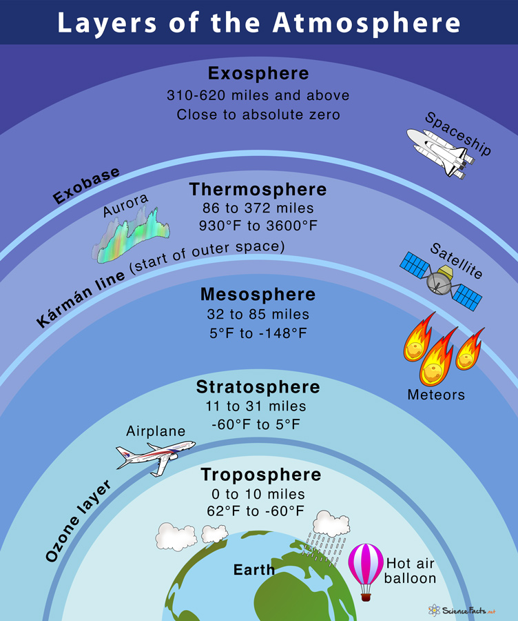

# Earth
* fifth largest planet. 
* Earth - english word mean ground or soil. 
* 7 -  continent; 5 - water bodies. 

* **Crust** - outer shell; mostly rock of density 2.7 to 3.3 g/cm3/.
* **Lithosphere** - 10 to 200km thick; break under stress and form tectonic plates (crust + uppermost mantle).
* **Asthenosphere** - 100 to 350km; part of upper mantle; exhibit plastic behavior. 
* **Upper Mantle** - 35 to 670km; $450- 900\degree C$; 
* **Mesosphere** - Also lower mantle - 670 to 2900km; strong rigi rock; Silicate minerals 3.2 to 5.7g/cm3;
* **Outer Core** - 2400km; nickel & iron - 9.9 to 12.2g/cm3; liquid layer; 
* **Inner Core** - 5150km; $5500\degree C$; 12.9g/cm3; 

